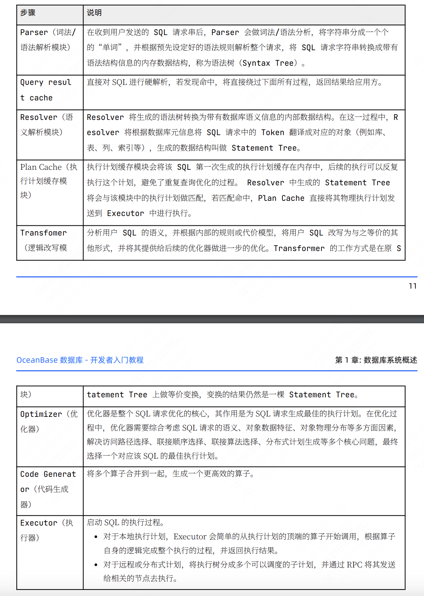
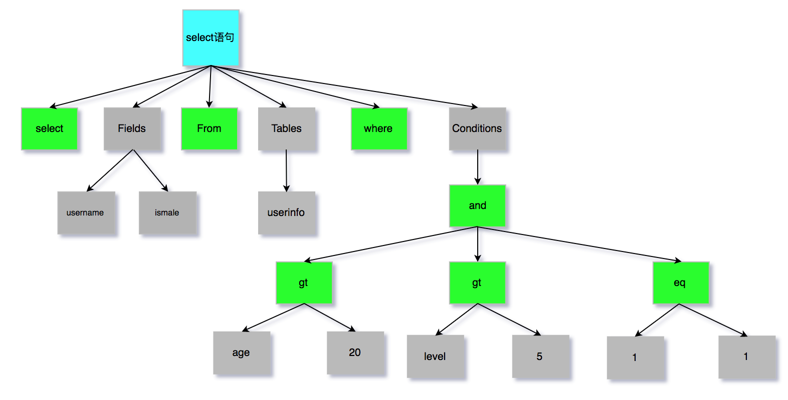
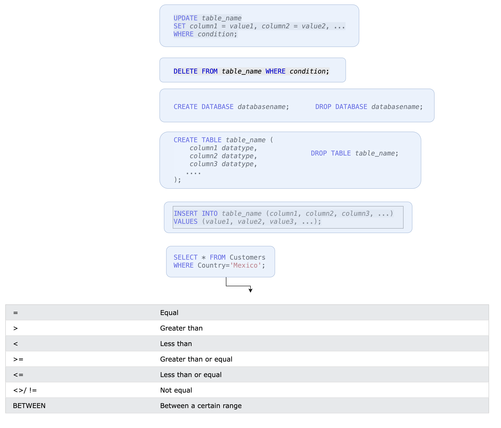

# 1、写在前面
如何实现一个DBMS呢？一个数据库管理系统是如何从头到尾设计的。
本项目将从简单到复杂，实现一个最基础的关系型数据库管理系统。在此基础上，还准备为其拓展适配向量数据库的部分功能。
# 2、版本0.0.1
本版本是一个基础的数据库管理系统。
系统通过使用启动时创建的命令行进行控制，不存在并发问题、不考虑数据的安全性。通过最简单方法实现一个数据库管理系统。以此理解关系型数据库的几大基本模块。
# 3、系统设计
## 3.1、SQL解析
如何高效地执行一条SQL？这是一个开放性问题，可以使用任何方法回答。但是当前的DBMS几乎全部无一例外地选择了将解析与执行独立的思路进行设计。SQL解析可以理解为一种编译手段，只不过编译的结果是一棵下层接口的执行树，而错误的SQL（语法错误，语意错误）都会无法被编译得到正确结果。
阿里巴巴的MiniOB教学文档中提到了一条SQL的具体执行过程：

其中第一步，一棵AST的例子如下：

可以理解AST是一棵不受下层实现影响的语法树，任何SQL经由语法分析得到的AST都是相同的（实际上可能由于树的约定表述逻辑不同，得到的AST的结构并不完全相同，但是其中蕴含的语意必定是相同的）。AST是下层语意解析的基础，语意解析将AST解析成数据库中具体的对象（见上图）。
由于支持全部的SQL的工作量过于巨大，如果全部手写很难在短时间内完成：
> Writing and maintaining our own SQL parser is a bad idea. SQL is complex, even for simple things like SELECT. And don't get me started on Common Table Expressions, sub-queries and other fun features

因此我选取了一部分核心SQL，提供解析执行能力。此版本具体支持的SQL特性见下图：

未来如果有精力，我还将引入三方库（如：libpg_query，postgres_parser）实现SQL解析，从而支持更多的SQL特性：

参考资料：
> 1、美团：什么是SQL解析：
> https://tech.meituan.com/2018/05/20/sql-parser-used-in-mtdp.html
> 2、SQL定义：
> https://www.w3schools.com/sql/sql_where.asp
> 3、Introducing pg_query: Parse PostgreSQL queries in Ruby
> https://pganalyze.com/blog/parse-postgresql-queries-in-ruby
> 4、PostgreSQL SQL解析引擎
> https://github.com/pganalyze/libpg_query
> 5、bustub 卡耐基梅隆 CMU 15445 项目
> https://github.com/cmu-db/bustub
> 6、阿里巴巴miniOB手册
> https://obcommunity-private-oss.oceanbase.com/prod/blog/2023-09/%E4%BB%8E0%E5%88%B01%20OceanBase%E5%8E%9F%E7%94%9F%E5%88%86%E5%B8%83%E5%BC%8F%E6%95%B0%E6%8D%AE%E5%BA%93%E5%86%85%E6%A0%B8%E5%AE%9E%E6%88%98%E5%9F%BA%E7%A1%80%E7%89%88.pdf

### 3.1.1 分词器
分词器的作用是将一条SQL语句分解为一个个的单词（token）。本系统支持的SQL暂时较为简单，支持解析的字段很少，因此可以选择多种分词方法。针对本版本支持的SQL，下面是一个最简单的分词器的设计：
#### 初步设计
由于不涉及到左右连接等复杂关系代数，所以分词器相对较简单。首先将所有可能的关键字枚举：
> UPDATE SET SHERE DELETE FROM WHERE CREATE DATABASE DROP TABLE INSERT INTO VALUES SELECT

接着列举可能出现的字符：
> = （ ）> < >= <= <> != ,

一个SQL首先会被上述的关键字分割成段，在每个段内部，SQL将再次被通过符号进行分割。比如一条SQL:
> SELECT * FROM table WHERE id = 1

将首先被分割为：
> | SELECT | * | FROM | table | WHERE | id = 1 |

接着，再次遍历，将每个段根据其类型再次执行不同的逻辑，并打上不同的标志：
> | SELECT | * | FROM    | table      | WHERE   | id = 1    |
> | SELECT | * | FROM    | table      | WHERE   | condition => "id" "1" "="|

这一步的主要作用是将条件语句拆分成可以被执行的片段
#### 总结
通过上述两个流程的分词，一条完整的SQL应该被分成了若干个token，并且去除了无效信息，如（）。解析器可以直接对分词器的结果解析，判断一条SQL是否符合语法标准，SQL中提到的关键数据是否都存在（数据库，表，字段名）。
### 3.1.2 解析器

### 3.1.3 执行器
2、存储引擎