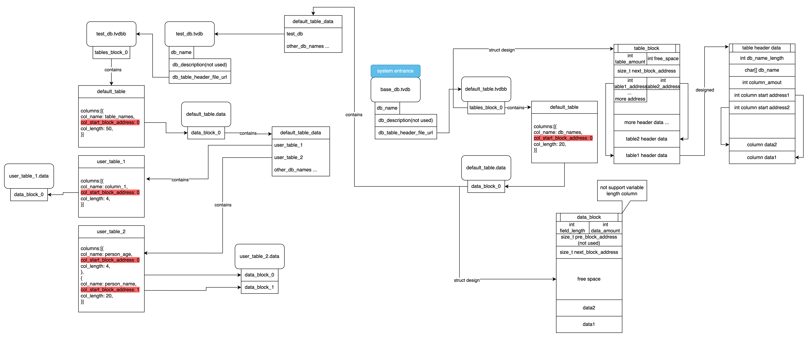
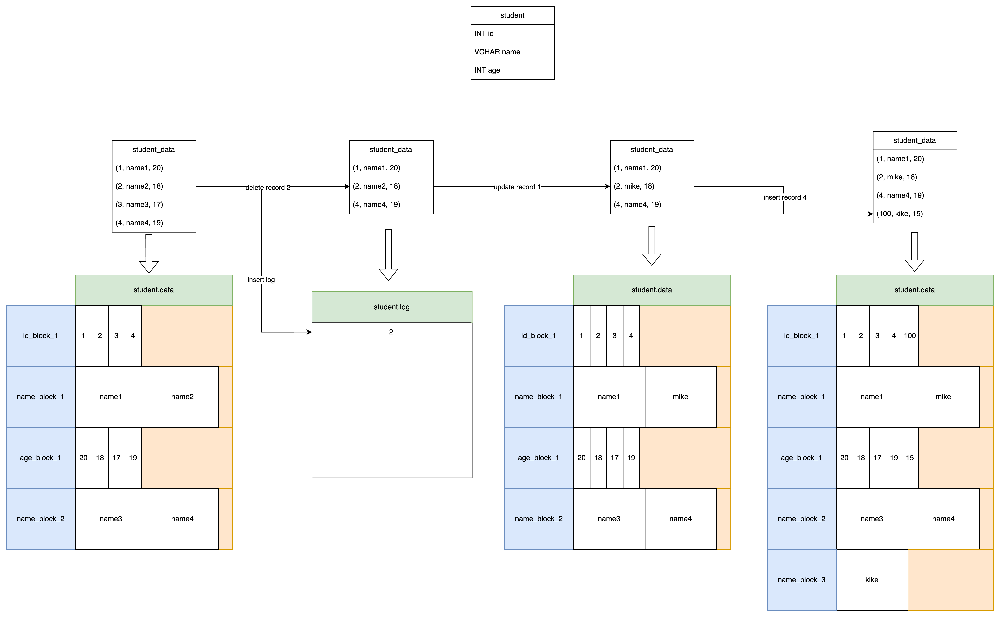
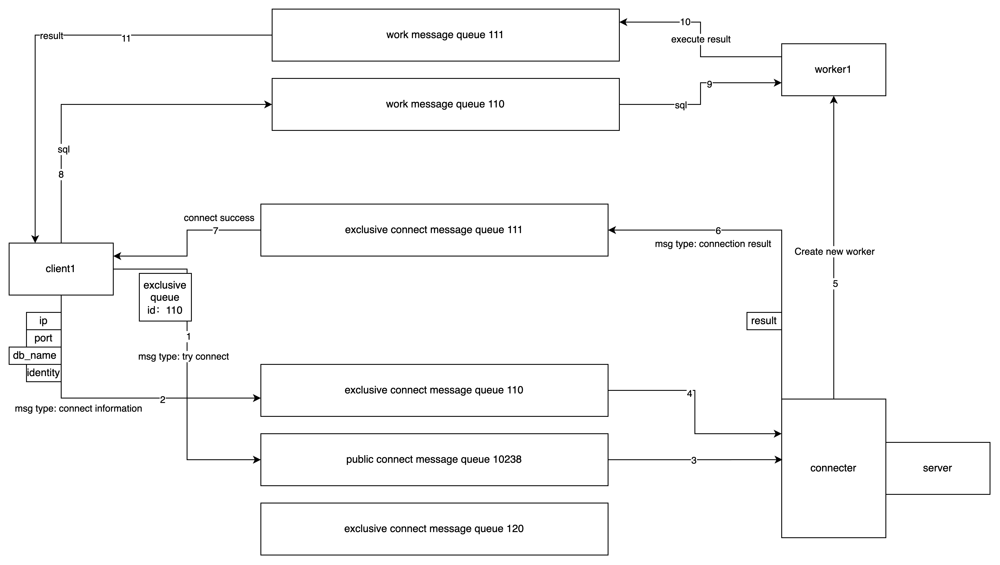
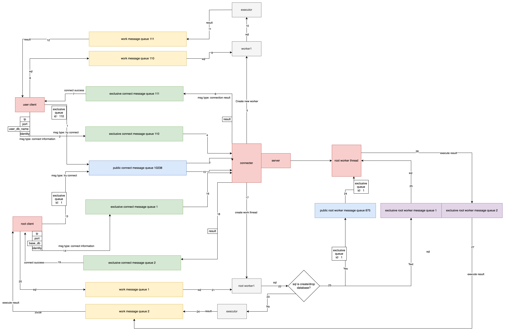

# 1、写在前面
如何实现一个DBMS呢？一个数据库管理系统是如何从头到尾设计的？
本项目将从简单到复杂，实现一个最基础的关系型数据库管理系统。在此基础上，还准备为其拓展适配向量数据库的部分功能。
# 2、版本0.0.1
本版本是一个基础的数据库管理系统。
系统通过使用启动时创建的命令行进行控制，不存在并发问题、不考虑数据的安全性。通过最简单方法实现一个数据库管理系统。以此理解关系型数据库的几大基本模块。
# 3、系统设计
## 3.1、SQL解析
如何高效地执行一条SQL？这是一个开放性问题，根据系统特性、数据特性，我们可以选择使用任何方法。但是当前的DBMS几乎全部无一例外地选择了将解析与执行分为两个模块，独立进行设计的思路。
SQL解析可以理解为一种编译手段，只不过编译的结果是一棵给下层执行模块使用的语法树，而错误的SQL（语法错误，语意错误）都会无法被编译得到正确结果。
阿里巴巴的MiniOB教学文档中提到了一条SQL的具体执行过程：

其中第一步，一棵AST的例子如下：

可以理解AST是一棵不受下层实现影响的语法树，任何SQL经由语法分析得到的AST都是相同的（实际上可能由于树的约定表述逻辑不同，得到的AST的结构并不完全相同，但是其中蕴含的语意必定是相同的）。AST是下层语意解析的基础，语意解析将AST解析成数据库中具体的对象（见上图）。
由于支持全部的SQL的工作量过于巨大，如果全部手写很难在短时间内完成：
> Writing and maintaining our own SQL parser is a bad idea. SQL is complex, even for simple things like SELECT. And don't get me started on Common Table Expressions, sub-queries and other fun features

因此我选取了一部分核心SQL，提供解析执行能力。此版本具体支持的SQL特性见下图：

未来如果有精力，我还将引入三方库（如：libpg_query，postgres_parser，lex&yacc）实现SQL解析，从而支持更多的SQL特性：

参考资料：
> 1、美团：什么是SQL解析：
> https://tech.meituan.com/2018/05/20/sql-parser-used-in-mtdp.html
> 2、SQL定义：
> https://www.w3schools.com/sql/sql_where.asp
> 3、Introducing pg_query: Parse PostgreSQL queries in Ruby
> https://pganalyze.com/blog/parse-postgresql-queries-in-ruby
> 4、PostgreSQL SQL解析引擎
> https://github.com/pganalyze/libpg_query
> 5、bustub 卡耐基梅隆 CMU 15445 项目
> https://github.com/cmu-db/bustub
> 6、阿里巴巴miniOB手册
> https://obcommunity-private-oss.oceanbase.com/prod/blog/2023-09/%E4%BB%8E0%E5%88%B01%20OceanBase%E5%8E%9F%E7%94%9F%E5%88%86%E5%B8%83%E5%BC%8F%E6%95%B0%E6%8D%AE%E5%BA%93%E5%86%85%E6%A0%B8%E5%AE%9E%E6%88%98%E5%9F%BA%E7%A1%80%E7%89%88.pdf

### 3.1.1 分词器（词法分析）
分词器的作用是将一条SQL语句分解为一个个的单词（token），也就是所谓的正则匹配。本系统支持的SQL暂时较为简单，支持解析的字段很少，因此可以根据本版本支持的SQL，设计一个简单的词法分析器。
#### 1.初步设计
1、根据预留关键词（如SELECT、UPDATE、左右括号、分号、逗号、空格等）进行匹配，将匹配到的关键词进行归类并设置类型，若所有关键词都无法进行匹配，则转向非关键词匹配
2、根据非预留关键词类型进行匹配，此处可能涉及到各种系统需要支持的数据的具体过滤方法，比如：表、列、数据库名称只允许出现英文字母和_，且两端不会被双引号包含；string类型的数据需要支持任何字符任何长度，但是两端会被双引号包含；日期类型的数据只支持"2024-08-01"这种模式的字符串。如果匹配到了，那么还需要将其设置为对应类型的数据。
3、从前到后将所有匹配到的数据类型和数据输出为一个列表，以供后续语法分析器进行分析。
如果匹配过程中出现了任意无法匹配的情况，那么都将直接返回错误。
#### 2.分词器功能举例
> 预留关键词：SELECT 空格 FROM 逗号 分号
> 非预留关键词: string：由任意长度任意类型字符构成的串，但是两端要被双引号包含起来。 id: 表示数据库名、表名、列名、索引名的数据，可以是任意非预留关键词，但是两端不会被括号括起来，只允许出现英文字母和_。

输入数据： 
> 数据1（合法）: SELECT test FROM table1_tt_ ;
> 数据2（非合法，又一个单独的双引号）: SELECT Table SELECT FROM table " ;

解析结果
> 数据1结果：|关键词: SELECT | id：test ｜ 关键词: FROM| id: table1_tt_| semicolon: ;|
> 数据2结果：|关键词: SELECT | id：Table | 关键词: SELECT | 关键词: FROM | id: table | 无法被解析的字符串，返回失败！
#### 3.总结
通过上述词法分析流程，一条完整的SQL应该被分成了若干个token，并且去除了无效信息，如空格。
#### 4.实现
上述分词器实现位于sql/parser/work_separater.h
### 3.1.2 语法分析
经过第一步的词法分析，一条SQL已经被解析成了一长串全部符合规定的token链表。而语法分析要做的就是判断这串token是否符合系统支持的sql格式。比如：判断一条SQL是否符合语法标准（SELECT后面必须跟着id，FROM后面必须跟着id，SELECT后面必须有FROM节点且它们之间只能是若干个被逗号分隔的id），SQL中提到的关键数据是否都存在（数据库，表，字段名），输入的数据是否合法（字段名不应该存在大写字母， 日期数据必须是“2024-01-01”这类格式）
#### 1.初步设计
语法分析首先要确定系统需要支持的语法都有哪些，以下是一些简单的语法：

> id: 不被双引号扩起来的，只有英文字母和下划线的字符串
其他id: , id
属性（可以被匹配为多种数据类型）: INT STRING FLOAT
比较符（可以被匹配为多种数据类型）: > < = >= <= <> != 
关系符（可以被匹配为多种数据类型）: AND OR
其他比较: , 关系符 id 比较符属性
其他属性: , 属性

> 创建数据库: CREATE DATABASE id;
删除数据库: DROP DATABASE id;
创建表: CREATE TABLE id ( id 其他id );
删除表: DROP TABLE id;
插入语句: INSERT INTO id (id 其他id) VALUES (属性 其他属性) ;
查询语句: SELECT id 其他id FROM id ;
查询语句(带条件): SELECT id 其他id FROM id WHERE id 比较符 属性 其他比较;
查询语句(内连接): SELECT id 其他id FROM id INNER JOIN id ON id = id WHERE id 比较符 属性 其他比较;

#### 2.语法分析器功能举例
输入SQL:
>  CREATE TABLE test_table ( id int, id2 vchar);

通过分词器，将得到一个token列表，如下：
> KEY_WORD: CREATE | KEY_WORD:TABLE | ID: test_table | op: ( | ID: id | KEY_WORD:int | ID: id2 | KEY_WORD:vchar | op: ) |

创建表SQL语法如上节，通过匹配，可以识别出几个创建表所需的数据：
> 表名：test_table
列名列表：id, id2
列类型列表：int, vchar

上述实现可阅读include/sql/sql_pattern和include/sql/ast，两个文件实现了sql语法定义，sql语意解析，构建AST的过程。
#### 3.总结
词法解析最终得到的是一棵可以用于规划执行计划的语法树。不同类型的SQL得到的语法树结构是大不相同的，因此执行器需要针对每种SQL都设计对应的执行计划。
### 3.1.3 执行器
拿到了语法树，最后一步就是解析并构建对应的执行计划。这一步主要要做的有几部分：将AST转换为系统的执行计划，判断执行计划是否需要优化并进行优化，执行。
之所以要设计这一步，是因为：虽然AST中提到的关键字和数据（表名，数据名）都是符合规定的，但是并不一定能够直接映射到我们数据库中真实的位置。我们需要检查输入sql的可行性，同时为可行的sql生成其对应的执行计划，也就是真正的执行函数。
对于简单的sql（如create，insert），执行计划可能不会出现较大变化，也不会有较大的嵌套调用，所以只需要设计一个执行函数，输入表、列、数据等关键信息即可执行。但是对于select语句，执行计划可能会因为select的列不同、join条件不同、嵌套sql等等原因，因此sql的执行函数必定无法写死，必须通过动态解析sql->列举各个算子之间的调用关系来生成执行函数，而这里的“列举的各个算子之间的调用关系”也就是我们常说的“执行计划”。

针对上述全部的sql语句，我们都需要创建对应特性的执行计划，或者需要对其中每个计算单元设计单独的可以任意拼接的算子。比如：
创建数据库: 执行计划包括 调用存储引擎提供的接口，查询数据库->创建数据库->返回结果 或者 直接创建数据库->返回结果。由于查询数据库接口是必定需要提供的，在客户端建立连接的过程中需要调用查询接口，所以这里的执行计划采用第一种。
创建表: 执行计划包括 检查连接缓存，判断用户是否有创建表的权力->查询表是否存在->创建表结构->写入表头数据->返回结果
插入语句: 执行计划包括 检查连接缓存，判断用户是否有访问表的权力->查询表头数据->检查所选列是否存在->检查插入数据类型与格式->插入数据->返回结果
查询语句: 执行计划无法一句话描述，需要针对每个特性设计对应的算子，比如： column_scan(扫描某列的全部数据)， column_inner_join（集合内交运算）， table_scan， hash_join， column_joint（拼接不同的列为一个整体）， b_plus_tree_column_scan(通过b+树索引扫描某列数据)， table_complete（根据某列的元素，将单列的单个数据补全为整行）。在此之后，根据解析的sql，自动拼接各个算子之间的调用关系，从而得到执行计划。这也是一般数据库都必须设计执行计划优化器的原因：自动拼接得到的sql一般还存在优化空间，比如：将条件判断算子下推到join算子之前从而减少join的数据量；由于本数据库在设计之初就是列存数据库，所以还可以很轻松地执行单列扫描，因此可以将table_complete上浮到单列条件判断算子之后；这里还存在更多的优化空间，但是前提是保持sql语意不变，更多的优化策略本版本将不会实现，留待后续扩展。

参考资料：
## 3.2、存储引擎
### 3.2.1 存储结构
本系统的文件结构如下图所示：

系统在install后会自动维护一个系统数据库（base_db），库中目前仅设计一张表，用于存储其他全部数据库的名称，从而定位其它数据库。未来可能还会拓展存储用户身份，密码等信息，从而实现权限设置。

本系统的底层存储格式为列存，设计原因是便于后续对向量的支持。列存数据库的存储有很多种优化方法，在此先将最简单的存储思路描述如下并实现。下图为最简单的列存结构图：

本图描述了一个拥有三个列的关系【student-（id，name，age）】，其中name列由于数据格式，空间消耗较大。

一开始关系有4条记录（以后都称其为record），每列的数据都存储在不同的block中，每个block都只存储一个列的数据。当一个块无法存储此列的全部数据时，将建立新块并顺序存储在其中，如name列的四个数据被分别存储在两个block中。每个列的数据都是顺序存储的，所以可以通过一个虚拟的Storage Keys来标识一个完整的record，这个Storage Keys是随着数据的增长单调递增的。比如上面的四条数据的Storage Keys就依次是0、1、2、3。但是这个Storage Keys来我们并没有实际存储，因为这会造成额外的空间损耗，而且会大大加大join、投影的复杂度。设计理念来自《C-Store: A Column-oriented DBMS》。

接着，删除了表中第三条数据，这条数据的Storage Keys是2。删除操作将向表的log文件插入一条日志，日志内容为删除的数据的Storage Keys。而读取表格数据，将通过扫描全部的block和log文件共同计算出结果：首先读取log文件并获取全部被删除的Storage Keys，接着读取block，并将Storage Keys对应的数据项从结果中剔除。也就得到了上面的表格。
通过这种方式，实现了Storage Keys的单调递增和数据有序性。

接着，进行了一次更新操作，更新操作将直接更新record对应的数据。并不产生日志。这里后续将通过lsm树的方式优化。

最后，进行了一次插入操作，插入操作直接在各个列的最后一块block中插入了数据，如果空间不足将继续拓展一块新的block。

> 参考文献：

>《C-Store: A Column-oriented DBMS》 
https://paper-notes.zhjwpku.com/assets/pdfs/cstore-vldb05.pdf

>

### 3.2.2 log 与 lsm tree（Log Structured Merge Tree）
TODO
### 3.2.3 buffer pool （memory manager）
虽然本系统在设计之初就确定为一个列存数据库，但buffer pool仍然是一个非常优秀的设计思路，它也可以为io优化，预判io，内存共享等优化方法提供支持。因此本系统保留了buffer pool的设计。
### 3.2.4 mvcc / lock
TODO

## 3.3、客户端-服务器架构
由于本系统是一个简单的模拟数据库，相较于复杂的网络模块（复杂原因包括：网络环境中的可靠问题、协议选择、debug难度、代码实现），我选择了使用消息队列实现客户端和服务器之间的可靠通讯。

目前本系统设计了两类用户：root与普通用户。

root用户用于访问base_db数据库，并执行各种sql；root用户拥有对数据库的修改权力，可以通过执行CREATE/DROP的语句对全部数据库进行新建或者删除。

普通用户在创立连接时需要选择连接的数据库（如系统在安装时默认创建的用户数据库:first_db），普通用户无法创建新的数据库，也不能删除数据库；普通用户可以在连接的数据库下执行各种sql，除了CREATE/DROP DATABASE语句。

下图为本系统的cs架构图：

<!--  -->

图中标号为顺序流图的执行顺序。图中包含了两类用户对应的客户端从建立连接开始到执行一条SQl并获取结果的全部过程。
### 3.3.1 server设计
server启动时会做两件事：

1、启动root处理线程，该线程将监听特定的消息队列中发送的信道号id消息，获取消息后监听具体的信道，再取得create/drop数据库的sql并执行。

2、启动connector线程，该线程的具体描述如下3.3.2节
### 3.3.2 connector设计
连接器（connector）是一个单独运行的线程，它的生命周期与server相同。在server启动时将自动创建connector线程，监听公共消息队列中申请建立连接的消息（msg1），监听到消息后将继续监听专有消息队列，监听到消息（msg2）后解析其中的连接具体信息（如客户端ip，port，连接数据库名，身份）后创建连接，并创建对应的worker线程用于处理后续sql。

在这里，我并没有对客户端只发送了一条msg1消息就停止运行的情况做特殊处理，因为本系统0.0.1版本设计的原则是尽可能简单。如果需要处理该情况，可以通过设置监听过期时间、消息确认等等机制，模仿网络情况进行处理。
### 3.3.3 worker设计
由于本系统在设计上以简单为原则，暂时不准备对高并发提供支持，因此server中工作线程worker的设计非常简单：为每个客户端维护一条工作线程，为其提供服务。
系统并没有使用线程池等工具对线程资源进行管理，而是通过绑定工作对象的方式自动完成工作线程的创建和销毁。

worker线程通过监听与client的专有消息队列，在得到sql消息后启动执行，在结束后将结果发送进入专有消息队列。

根据建立连接的数据库不同，worker线程有两类。

用户worker在获取到CREATE/DROP DATABASE这类sql后将直接返回执行失败。

而ROOT权限的workr（简称root_worker）将会把这类sql转发给server创建的root处理线程，root处理线程将处理结果通过专用消息队列通道发送给root_worker，root_worker再将结果发送给客户端。在此过程中root_worker充当了客户端与root处理线程之间的消息转发器的角色。
### 3.3.4 client设计
客户端主要功能是向公共消息队列发送连接申请消息msg1（包含专有消息队列id），然后向专有消息队列中发送连接信息消息msg2，监听专有消息队列获取服务器的连接建立结果。

若连接成功建立，客户端将读取输入作为sql，通过专有消息队列向服务器发送sql消息，监听返回消息并输出。

这里我并没有设计client主动断开连接的机制，同样是为了简单。我们可以通过建立连接相同的方法，向公共消息队列中发送断开连接消息，实现主动断开连接，减少server的性能消耗。更复杂的设计可以参考网络传输中可能遇到的各种问题，从而完善该模块。