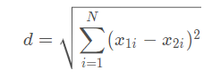
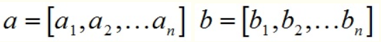
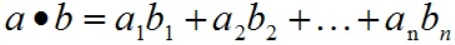

# 不同类型的距离度量方法
距离是衡量两个向量相似度的方法，距离越远，则向量越不相似。现在业界中有若干距离度量方法，在这个项目中我选取了一部分进行解释，并在代码中实现。不同的距离度量方法，拥有不同的时间复杂度，不同的空间时间消耗，也拥有不同的度量效果。
## 欧式距离（欧几里得距离）（Euclidean Distance）
欧式距离是将两个向量每位的差值平方后加和，最后对和开根号得到的距离。在二维空间中表示两个点的直线距离。

在项目中的实现为：
> include/distance/euclidean_distance.h

## 内积 （Inner Product）
如果两个向量定义如下

那么它们的内积为

在项目中的实现为：
> include/distance/inner_product.h

## todo

# 不同类型的索引
1、向量数据库的索引结构可以根据不同数量级的数据进行取舍。
## FLAT
FLAT索引即精确检索，对向量直接进行检索，能达到 100% 的检索召回率。精确检索的本质就是线性查找。线性查找通过在整个向量空间内，遍历所有已存向量计算其与检索向量的距离。随着向量集的规模的增大或者向量维度的增加，精确建索很难满足实际业务的需要。
但是由于其是精确索引，可以用来判断其他索引的召回率，因此可以将其作为准确率基准使用。

# 索引选型
FLAT：FLAT 最适合于在小型百万级数据集上寻求完全准确和精确的搜索结果的场景。
IVF_FLAT：IVF_FLAT 是基于量化的索引，最适合于在准确性和查询速度之间寻求理想平衡的场景。还有一个 GPU 版本 GPU_IVF_FLAT。
IVF_SQ8：IVF_SQ8 是一种基于量化的索引，最适合于在磁盘、CPU 和 GPU 内存消耗非常有限的场景。
IVF_PQ：IVF_PQ 是一种基于量化的索引，最适合于在牺牲准确性的情况下追求高查询速度的场景。还有一个 GPU 版本 GPU_IVF_PQ。
HNSW：HNSW 是一种基于图的索引，最适合于对搜索效率有很高要求的场景。
